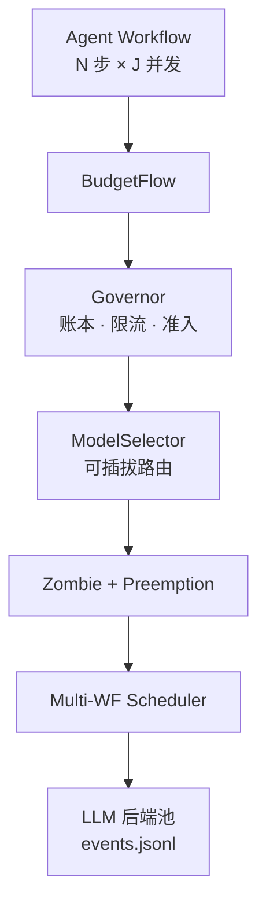

<!-- ═══════════════════ COVER ═══════════════════ -->

<div class="bf-cover">

# BudgetFlow

<p class="bf-subtitle">面向 Agent 工作流的动态预算路由机制</p>

<p class="bf-cover-desc">
固定预算与共享配额下，跨多条 workflow 的成本–质量调度与可复现实验叙事
</p>

<nav class="bf-cover-nav">
  <span @click="$slidev.nav.next" class="bf-cover-btn">开始 →</span>
  <span class="bf-cover-hint">Space 翻页</span>
</nav>

</div>

---
layout: two-cols
layoutClass: gap-10
---

## 主线速览

<div class="bf-toc-roadmap text-lg text-slate-700 leading-relaxed dark:text-slate-200">

**主线 → RQ → 架构 → 相关工作 → 差异轴 → BoPO → vLLM 叙事 → 附录**

</div>

::right::

<div class="bf-card bf-toc-card">

<p class="bf-toc-card-label">章节目录</p>

<Toc minDepth="1" maxDepth="1" />

</div>

---
layout: section
class: bf-section text-center
---

<!-- ═══════════════════ PART I ═══════════════════ -->

# Part I
## 论文主线与问题

---

## 1. 论文主线

<ul class="bf-bullets">

<li>

在一个甚至多个完整的 agent workflow 中，如何利用 **workflow 级的结构信息**——哪一步关键、剩多少预算、多个 workflow 如何共享资源——做整体的 **成本–质量分配**？

</li>

<li class="bf-bullet-indigo">

当优化单位从「一次 LLM 请求」变成「一个完整 agent workflow」，且多个 workflow **共享同一预算池** 与多条后端的 **RPM / 并发配额** 时，**显式维护 workflow 状态** 是否会改变 **固定预算** 下的成功率？收益来自 **预算配速、步骤重要性、进展先验** 还是 **多 workflow 调度**？本文把 LLM 花费变成 **可审计、可消融、可复现** 的实验对象。

</li>

</ul>

---
layout: section
class: bf-section text-center
---

<!-- ═══════════════════ PART II ═══════════════════ -->

# Part II
## 研究问题与贡献

---

## 2.1 三个研究问题

<div class="bf-table-sm">

| RQ | 问题 | 主要指标 |
|:---|:---|:---|
| **RQ1** | 多 workflow 在同一固定预算与共享后端限流下并行运行时，预算浪费在何处、哪些运行时限制最先成为瓶颈？ | 预算违规率、429 率、队列延迟、回收预算、僵尸取消数等 |
| **RQ2** | 相同预算下，利用 workflow 阶段状态做多步模型档位选择，是否比「仅按 workflow」或「仅按预算」的调度 resolve 更多 SWE-bench 类任务？ | 固定预算下 resolved rate；BudgetFlow Full vs Workflow-Level Router vs Budget-Only Step Scheduler |
| **RQ3** | 换模型削弱 prefix-cache 局部性时，workflow 阶段调度是否仍能带来净收益？ | 换模频率、prefill 延迟、cached-token 比例；Full vs Cache-Sticky |

</div>

<div class="flex gap-4 mt-6">

<span class="bf-tag bf-tag-blue">RQ1 → Runtime 画像</span>
<span class="bf-tag bf-tag-green">RQ2 → 功效</span>
<span class="bf-tag bf-tag-amber">RQ3 → 系统代价</span>

</div>

---

## 2.2 独特贡献

<div class="grid grid-cols-1 gap-3">

<div v-click class="bf-card">
  <span class="bf-card-label">连续质量视角</span> — LLM 质量视为 [0,1] 连续变量
</div>

<div v-click class="bf-card">
  <span class="bf-card-label">硬预算 + 动态配速</span> — <code>budget_factor</code> 近似预算边际价值 λ
</div>

<div v-click class="bf-card">
  <span class="bf-card-label">显式任务价值 w_i</span> — 调用方声明、可解释
</div>

<div v-click class="bf-card">
  <span class="bf-card-label">僵尸止损</span> — 截断「成本涨、质量不涨」的无效调用
</div>

<div v-click class="bf-card">
  <span class="bf-card-label">无需训练</span> — 启发式即时部署，较 RL 路线更轻
</div>

</div>

---
layout: section
class: bf-section text-center
---

<!-- ═══════════════════ PART III ═══════════════════ -->

# Part III
## 系统架构

---
layout: two-cols
layoutClass: gap-10
---

## 3. 项目架构（分层）

::left::



::right::

<div class="bf-arch bf-arch-compact">

```
Agent Workflow（N 步 LLM）× J 并发
        │
        ▼
┌────────── BudgetFlow 四层 ──────────┐
│ [约束] Governor      policy-agnostic │
│ [优化] ModelSelector routing policy   │
│ [止损] ZombieDetector policy-agnostic │
│ [调度] Multi-WF Sched. policy-agnostic│
└──────────────────────────────────────┘
        │
        ▼
 LLM 后端池 → events.jsonl → 指标
```

</div>

---
layout: section
class: bf-section text-center
---

<!-- ═══════════════════ PART IV ═══════════════════ -->

# Part IV
## 相关工作与边界

---

## 4. 相关工作分类

<div class="grid grid-cols-2 gap-6 mt-4">

<div v-click>
  <h3 class="bf-card-label">操作系统资源管理</h3>
  <p class="text-slate-500 text-sm">AgentRM · AgentCgroup · AIOS · pMVX</p>
</div>

<div v-click>
  <h3 class="bf-card-label">任务–模型路由</h3>
  <p class="text-slate-500 text-sm">RouteLLM · CARROT · OmniRouter</p>
</div>

<div v-click>
  <h3 class="bf-card-label">分步 RL 路由</h3>
  <p class="text-slate-500 text-sm">BoPO · xRouter</p>
</div>

<div v-click>
  <h3 class="bf-card-label">GPU 预算 · 硬件编排</h3>
  <p class="text-slate-500 text-sm">Athena-Serve · Murakkab</p>
</div>

</div>

---

## 5 — 相关工作一览

对比维度：**硬顶** = 多并发共享 USD/token 硬顶 + 预留结算 · **状态** = 同轨迹多轮 LLM 状态化选档 · **免训** = 无需域数据大规模离线训练

<div class="bf-table-scroll bf-table-xs">

| §4 聚类 | 工作 | 硬顶 | 状态 | 免训 | 与本文差异 |
| :--- | :--- | :---: | :---: | :---: | :--- |
| **（本文）** | **BudgetFlow** | ✓ | ✓ | ✓ | — |
| 操作系统资源管理 | AgentRM (2603.13110) | ✗ | ✗ | ✓ | RPM / 稳定 / 回收；非 API 美元硬账本 |
| 操作系统资源管理 | AgentCgroup (2602.09345) | ✗ | ✗ | ✓ | 主机 CPU / Mem cgroup |
| 操作系统资源管理 | AIOS (2403.16971) | ✗ | ✗ | ✓ | Agent OS 抽象 |
| 操作系统资源管理 | pMVX (Agentic OS Wkshp 2026) | ✗ | ✗ | ✗ | Kernel 多版本策略自调优 |
| 任务-模型路由 | RouteLLM (Ong et al. 2024) | ✗ | ✗ | ✗ | 偏好学习；无运行预算账本 |
| 任务-模型路由 | CARROT (2502.03261) | ✗ | ✗ | ✓ | Per-query minimax；无跨步联合状态 |
| 任务-模型路由 | OmniRouter (Mei et al. 2026) | ✗ | ✗ | ✗ | Per-query Lagrangian；非多 WF 池 |
| 分步骤 RL 路由 | **BoPO** (2602.21227) | ✗ | ✓ | ✗ | 单任务 RL step；可插 ModelSelector |
| 分步骤 RL 路由 | xRouter (2510.08439) | ✗ | ✓ | ✗ | RL 工具 / 多模型编排；非共享池账本 |
| GPU 预算 | ATHENA-Serve | ✗ | ✗ | ✗ | Serving 长尾与 KV / 算力 budget |
| 硬件编排 | Murakkab（待投） | ✗ | ✗ | ✗ | 云 / WF 成本与并行；无 USD/token 硬顶账本 |

</div>

<p class="text-sm text-slate-500 mt-2">Murakkab、ATHENA-Serve 可与本文纵向叠放；表内仅收录 §4 已索引文献。</p>

---
layout: two-cols
layoutClass: gap-10
---

## 论文边界

::left::

### ✅ 本文明确覆盖

- **单一预算主体**：多 workflow 共享预算池与 RPM / 并发；账本、准入、结算、Zombie、调度均属 runtime 命题
- **决策单位**：每一步 LLM 调用 + 全局预算池；评测对齐 SWE-bench Verified 并发与固定总预算

::right::

### ❌ 本文不 Claim

- Multi-tenant、跨团队 SLA（§8 叙事第二阶段）
- 不取代 KV/batch 全集最优；聚焦 workflow 花费治理
- ZombieDetector：构件级消融，非单独 ML 方法论主贡献
- 成本模型：抽象 dollar / token，不绑 SKU

---
layout: section
class: bf-section text-center
---

<!-- ═══════════════════ PART V ═══════════════════ -->

# Part V
## 差异轴 · BoPO / Router / OS

---

## 6.1 vs BoPO（Budget-Aware Agentic Routing）

<div class="bf-table-sm">

| 维度 | BoPO | **BudgetFlow（本文）** |
|:---|:---|:---|
| **方法** | RL（BoPO），需要训练数据与 GPU | 启发式，无需训练，即时部署 |
| **可解释性** | 策略难解释 | 边际性价比 + `budget_factor` |
| **预算** | 训练 soft-budget + 推理 BCD | 运行时 hard budget |
| **任务价值** | RL 隐式 | 显式 w_i（调用方声明） |
| **止损** | 无专门机制 | ZombieDetector |
| **互补性** | — | 本文可作 RL warm-start |

</div>

---

## 6.2 vs Per-query Routers

<div class="bf-table-sm">

| 维度 | Per-query Routers | **BudgetFlow（本文）** |
|:---|:---|:---|
| **决策** | 每条 query 独立最优 | 跨 N 步联合预算约束 |
| **状态** | 无状态 | 有状态（预算 / burn rate） |
| **预算** | 忽略或仅 per-query 预测 | Hard budget |
| **任务价值** | 不区分 | 显式 w_i |

</div>

---

## 6.3 vs OS-Inspired

<div class="bf-table-sm">

| 维度 | OS-Inspired | **BudgetFlow（本文）** |
|:---|:---|:---|
| **核心问题** | 稳定性 / 隔离 | 质量–成本优化 |
| **优化目标** | 延迟 / 吞吐 / 隔离 | QWCR，Q/成本，Pareto |
| **资源** | CPU / 内存 / 并发 / RPM | LLM 调用质量与成本 |

</div>

---
layout: section
class: bf-section text-center
---

<!-- ═══════════════════ PART VI ═══════════════════ -->

# Part VI
## BoPO 与本文关系

---

## 7. BoPO 论文摘要

**Budget-Aware Agentic Routing via Boundary-Guided Training**
Zhang et al., arXiv:2602.21227, 2026

**BoPO** = Boundary-Guided Policy Optimization：按 agent **step** 做 RL；训练侧含 BoSFT，在线侧 GRPO 等边界引导，缓解稀疏奖励。

---

### 7.1 与本文的关系

<div class="grid grid-cols-3 gap-4 mt-4">

<div v-click class="bf-card">

##### BoPO

单任务 **step 级路由**

→ 对应 ModelSelector 的可插拔实现

</div>

<div v-click class="bf-card">

##### BudgetFlow 底座

全局账本 · RPM/并发准入 · 多 WF 调度 · ZombieDetector

</div>

<div v-click class="bf-card">

##### 组合

底座 **兼容 BoPO**

RL 接入 ModelSelector，运行时仍保证全局硬约束

</div>

</div>

---

### 7.2 极简场景（SWE-bench 对齐）

<div v-click>

**单轨迹**：读 issue → 搜仓库 → … → 迭代；单任务预算例如 **0.5 USD**；每步强弱模型

</div>

<div v-click class="mt-3">

**BoPO**：域内大量轨迹预训练；每步结合上下文、历史与 **该任务剩余预算**；奖励绑定 **单任务** 成败与花费；边界引导鼓励关键步用强模

</div>

<div v-click class="mt-3">

**本文评测焦点**：多实例共享总预算；在 **全局就绪 call** 上按边际进度、budget pressure **系统级择优**，优化 **汇总完成率**

</div>

---

### 7.3 BudgetFlow vs BoPO

<div class="bf-table-sm">

| 维度 | BudgetFlow | BoPO |
|:---|:---|:---|
| **优化目标** | 共享硬预算 + 配额下全局完成率 | 单任务预算–成功率；单轨迹局部最优 |
| **视野** | 跨 WF 账本与就绪队列 | 单 trajectory + 该任务剩余预算 |
| **预算 / 配额** | 预留–结算、429 / 并发准入 | soft-budget + BCD（非原子账本语义） |
| **止损** | Zombie、抢占、回收预留 | 无对等机制 |
| **部署** | Training-free | 域数据 + 训练 |
| **组合** | BoPO policy 可插 ModelSelector | 不替代全局治理层 |

</div>

---

### 7.4 BoPO 明确不覆盖（本文差分）

<ul class="bf-bullets">

<li>多 agent <strong>共享单一全局预算</strong> 与「前期耗光、后期饥饿」</li>
<li>生产级 <strong>RPM / 并发</strong> 强准入与 429 治理</li>
<li><strong>僵尸 / 无进度</strong> 占用预算与槽位回收</li>
<li><strong>KV / 本地推理</strong> 切换代价显式建模</li>
<li><strong>零域数据</strong> 下的免训练冷启动路由</li>

</ul>

---
layout: section
class: bf-section bf-hero-img text-center text-white
background: /side-flow.jpg
---

<!-- ═══════════════════ PART VII ═══════════════════ -->

# Part VII
## 叙事：参照 vLLM

<p class="text-slate-300 mt-2" style="font-size: clamp(1.05rem, 0.4vw + 0.95rem, 1.25rem); line-height: 1.5;">
single-tenant 机制 → multi-tenant / multi-owner 政策层
</p>

---

## 8. 叙事：参照 vLLM（1 / 2）

<div class="space-y-4">

<div v-click>

**vLLM（SOSP 2023）**：single-tenant 下 batch 与吞吐优化；单一运营方假设，未讨论竞争用户间仲裁

</div>

<div v-click>

**后续**（Andes OSDI 2024、SGLang router）：multi-tenant，priority / quota / SLA

</div>

<div v-click>

**两阶段路径**：先机制（paged KV、continuous batching），再在充分理解 single-tenant 后叠加政策层

</div>

</div>

---

## 8. 叙事：参照 vLLM（2 / 2）

<div class="space-y-4">

<div v-click>

**BudgetFlow**：对齐该路径；本文处理 **single-budget-owner**，贡献为 **cost-model-agnostic** 的跨 workflow 调度

</div>

<div v-click>

**续作**：multi-tenant agent 计算分配 — cross-tenant 隔离、异构 quota、budget-aware admission

</div>

<div v-click>

**cost-model-agnostic 保留**：租户可用不同模型与成本结构，仲裁层无需重写

</div>

<div v-click>

**定位**：未来 multi-tenant workflow 工作可构建其上的 **single-tenant 基础**

</div>

</div>

---
layout: section
class: bf-section text-center
---

<!-- ═══════════════════ APPENDIX ═══════════════════ -->

# Appendix
## 集成与栈位

---

### A.1 集成架构

<div class="bf-arch">

```
LangChain / SWE-agent / AutoGen  +  自建平台
  Proxy / Adapter / SDK  →  BudgetFlow Runtime
  → Governor → ModelSelector → Scheduler → Backend Pool
```

</div>

<p class="text-sm text-slate-500 mt-4">ASCII 完整版见论文大纲原文</p>

---

### A.2 计算栈分层

<div class="bf-arch">

```
Murakkab      云硬件成本 / SLO · 无 USD 硬顶
     ↓
BudgetFlow    固定预算 · 硬上限 · 步骤 + 全局池
     ↓
Aragog/Parrot 吞吐与流水线（与 §5 正交）
     ↓
Hardware
```

</div>

---
layout: center
class: text-center
---

<!-- ═══════════════════ THANKS ═══════════════════ -->

# 谢谢

<p style="font-size: 1.1rem; color: #64748b; margin-top: 0.75rem;">BudgetFlow · 论文大纲汇报</p>

<button
  style="margin-top: 2rem; padding: 0.6rem 2rem; border-radius: 9999px; background: #0f172a; color: #fff; border: none; font-size: 0.9rem; cursor: pointer;"
  @click="$slidev.nav.go(2)">
  回到目录
</button>

<p style="margin-top: 1.5rem; font-size: 0.85rem; color: #94a3b8;">
  配图：public/cover-datacenter.jpg · side-network.jpg · side-flow.jpg（Unsplash）
</p>

